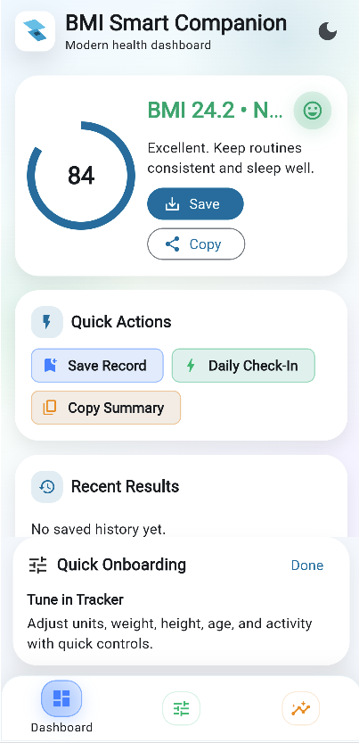
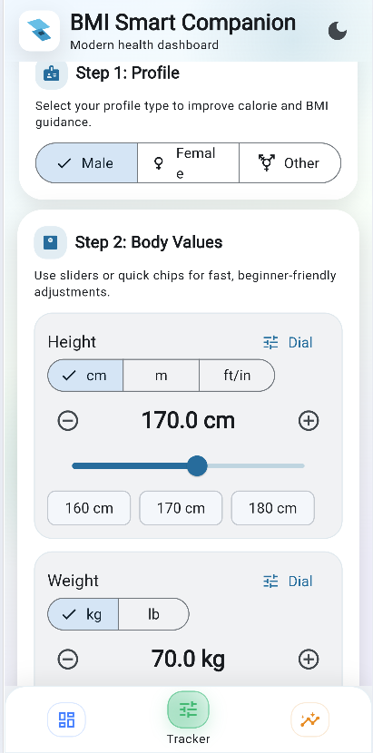
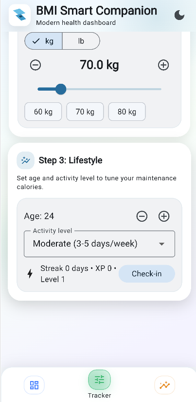
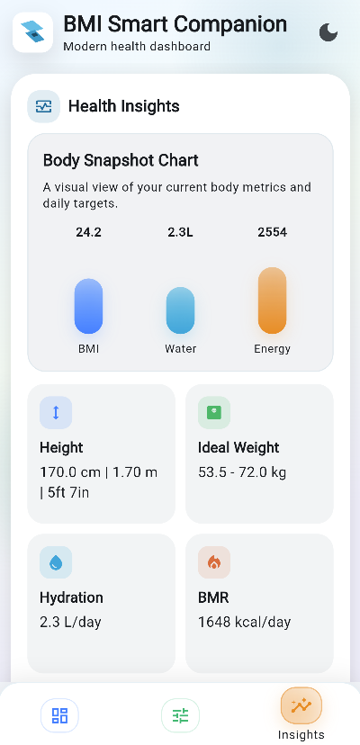
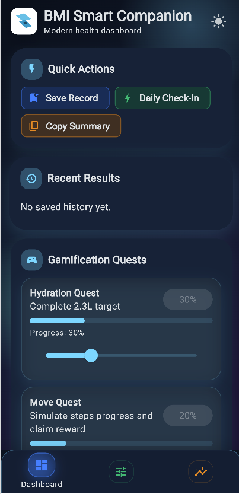
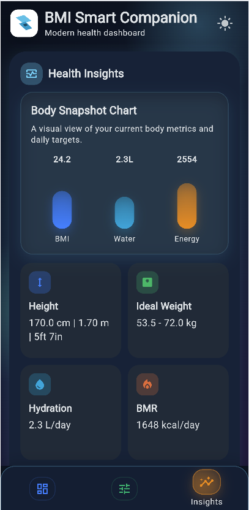
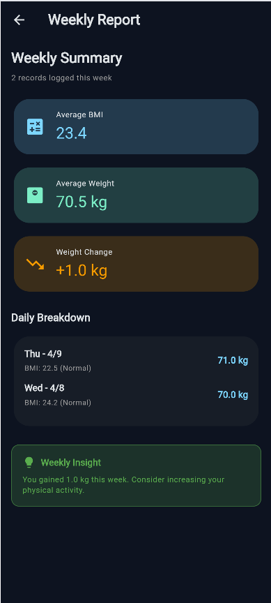
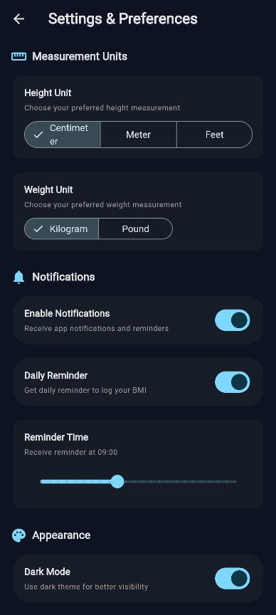

# 🏥 BMI Smart Companion

[](https://flutter.dev)
[](https://dart.dev)
[](LICENSE)
[]()

A **production-ready, feature-rich health companion app** built with Flutter. BMI Smart Companion combines precise body metric calculations with engaging gamification mechanics to encourage consistent health tracking and lifestyle awareness.

---

## 📋 Table of Contents

| Section | Link |
|---------|------|
| **Getting Started** | [Overview](#-overview) • [Installation](#-installation) |
| **Features & Usage** | [Key Features](#-key-features) • [Usage](#-usage) • [Screenshots](#-screenshots) |
| **Technical** | [Tech Stack](#-tech-stack) • [Architecture](#-architecture) |
| **Community** | [Contributing](#-contributing) • [License](#-license) • [Contact](#-contact) |

---

## 🎯 Overview

BMI Smart Companion is a modernized evolution of traditional BMI calculators, designed as a production-ready utility for:

- **Fast & Intuitive Input**: Interactive card-based UI for seamless body metric entry
- **Comprehensive Health Metrics**: BMI status, ideal weight range, hydration targets, BMR, and caloric guidance
- **User Engagement**: Gamification through daily streaks, XP progression, and quest-based challenges
- **Multi-Platform Support**: Native Android, iOS, and web experiences
- **Data Persistence**: Secure local storage with clipboard-ready sharing capabilities

---

## ✨ Key Features

### 📊 **Advanced BMI & Health Analytics**
- Real-time BMI calculation with status interpretation (Underweight, Normal, Overweight, Obese)
- Ideal weight range recommendations
- Daily hydration targets (hydration status tracking)
- Basal Metabolic Rate (BMR) calculations
- Activity-adjusted daily caloric requirements
- Multi-unit support: cm/m/ft·in for height; kg/lb for weight

### 🎮 **Gamification Engine**
- Daily check-in streak system with visual progress
- XP-based leveling and achievement unlocks
- Quest-based interactions (hydration quest, movement quest)
- Reward claiming mechanism for completed challenges
- Real-time progress visualization

### 🎨 **Modern User Experience**
- Animated splash experience with custom branding
- Interactive animated cards replacing static forms
- Smooth micro-interactions and transitions
- Dark mode support with context-aware theming
- Responsive design across devices and screen sizes

### ⚙️ **Precision Input Workflow**
- Range sliders for quick adjustments
- Increment/decrement controls for fine-tuning
- Dedicated dial interface for precise value entry
- Multiple unit system conversions
- State persistence across sessions

### 📱 **Multi-Platform**
- Native Android performance and design
- Native iOS experience
- Responsive web experience
- Seamless synchronization across platforms

### 💾 **Data Management**
- Local history of saved BMI records
- Persistent game state (XP, streaks, quest progress)
- Clipboard-ready health summaries for easy sharing
- Background-safe state management

### ⚡ **Smart Notifications** (April 2026)
- Daily BMI reminder notifications at customizable times
- Weekly progress report notifications
- Cross-platform support (Android & iOS)
- Timezone-aware scheduling with automatic adjustments

### ⚙️ **Settings & Preferences** (April 2026)
- Flexible measurement units (cm/m/ft for height, kg/lb for weight)
- Notification configuration with time selection
- Theme and appearance customization
- Clean, Material3-designed settings interface

### 📊 **Weekly Progress Reports** (April 2026)
- 7-day averages for BMI and weight metrics
- Daily breakdown table with timestamps
- Weight change tracking and analysis
- Actionable health insights based on trends

---

## 📸 Screenshots

### **Light Mode Experience**

| Dashboard | Tracker Setup | 
|:---:|:---:|
|  |  |

| Body Metrics | Health Insights |
|:---:|:---:|
|  |  |

### **Dark Mode Experience**

| Quick Actions & Quests | Health Analytics |
|:---:|:---:|
|  |  |

### **Weekly Reports & Settings**

| Weekly Report | Settings & Preferences |
|:---:|:---:|
|  |  |

---

## 🛠️ Tech Stack

| **Category** | **Technology** |
|:---|:---|
| **Framework** | Flutter 3.0+ |
| **Language** | Dart 3.0+ |
| **State Management** | StatefulWidget, Provider pattern |
| **Local Storage** | Shared Preferences (via shared_preferences plugin) |
| **UI/UX** | Material 3 Design System |
| **Animation** | Tween Animation Builder, Implicit Animations |
| **Build System** | Gradle (Android), Xcode (iOS) |
| **Version Control** | Git |

---

## 📦 Installation

### Prerequisites
- Flutter 3.0 or higher
- Dart 3.0 or higher
- Android Studio / Xcode (for native development)
- Git

### Clone & Setup

```bash
# Clone the repository
git clone https://github.com/Anees040/bmi_calculator_master.git
cd bmi_calculator-master

# Get Flutter dependencies
flutter pub get

# Run the app
flutter run
```

### Platform-Specific Setup

**Android:**
```bash
flutter run -d <device-id>
```

**iOS:**
```bash
cd ios
pod install
cd ..
flutter run
```

**Web:**
```bash
flutter run -d chrome
```

---

## 🚀 Usage

### First Launch
1. **Onboarding Guide**: Follow the Quick Onboarding to calibrate your profile
2. **Select Profile Type**: Choose Male, Female, or Other for personalized recommendations
3. **Input Body Metrics**: 
   - Set your height (cm, m, or ft·in)
   - Enter your weight (kg or lb)
   - Select age and activity level

### Daily Usage
- **Dashboard Tab**: View current BMI, recent results, and available quests
- **Tracker Tab**: Adjust metrics with sliders or precision dial input
- **Insights Tab**: Review health metrics and body snapshot analytics
- **Quick Actions**: Save records, perform daily check-in, copy health summary

### Gamification
- **Streaks**: Maintain consecutive daily check-ins for XP rewards
- **Quests**: Complete hydration and movement challenges
- **Levels**: Progress through levels by earning XP
- **Rewards**: Claim milestone badges upon achievement

---

## 🏗️ Architecture

### Project Structure

```
lib/
├── main.dart                          # App entry point
├── app/
│   ├── app_root.dart                  # Root widget configuration
│   └── theme/
│       └── app_theme.dart             # Material 3 theming configuration
└── features/
    └── bmi/
        ├── data/
        │   └── local_store.dart        # SharedPreferences persistence layer
        └── presentation/
            └── pages/
                └── bmi_home_page.dart  # Main dashboard & tab UI

test/
└── widget_test.dart                   # Widget test suite
```

### State Management
- **Stateful Widgets**: Local widget state for interactive components
- **Provider Pattern**: Future state management capability
- **Local Persistence**: SharedPreferences for app-level state durability

### Key Components
1. **BMI Calculation Engine**: Precise metric conversion and health status interpretation
2. **Gamification System**: Streak tracking, XP accumulation, quest management
3. **UI Animation Layer**: Smooth transitions and micro-interactions via TweenAnimationBuilder
4. **Persistence Layer**: Encrypted local storage with async I/O

---

## 🤝 Contributing

We welcome contributions! Please follow these guidelines:

1. **Fork** the repository
2. **Create** a feature branch (`git checkout -b feature/amazing-feature`)
3. **Commit** changes with clear messages (`git commit -m 'Add amazing feature'`)
4. **Push** to your branch (`git push origin feature/amazing-feature`)
5. **Open** a Pull Request with detailed description

### Code Standards
- Follow Dart style guide (dartfmt)
- Include widget tests for new features
- Document complex logic inline
- Test on multiple devices/screen sizes

---

## 📄 License

This project is licensed under the **MIT License** - see the [LICENSE](LICENSE) file for details.

---

## 📞 Contact

**Developer**: Anees Ahmad
- **Email**: [sp23-bse-030@isbstudent.comsats.edu.pk](mailto:sp23-bse-030@isbstudent.comsats.edu.pk)
- **GitHub**: [@Anees040](https://github.com/Anees040)
- **Repository**: [bmi_calculator_master](https://github.com/Anees040/bmi_calculator_master)

---

## 🙏 Acknowledgments

- Flutter team for the excellent framework
- Material Design 3 specification
- Community contributors and testers

---

### 🎯 **Future Roadmap**

- [ ] Cloud synchronization for multi-device sync
- [ ] Advanced analytics dashboard
- [ ] Social sharing & leaderboards
- [ ] Wearable integration
- [ ] AI-powered health recommendations
- [ ] Offline-first architecture

---

<div align="center">

**Made with ❤️ by Muhammad Anees**

*Last Updated: April 8, 2026*


