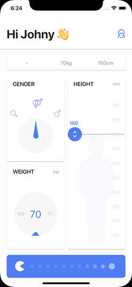

# BMI Smart Companion

A professional Flutter-based health utility focused on BMI analysis, practical body-metric conversions, and user engagement through gamified daily tracking.

## Project Overview

BMI Smart Companion is a modernized and production-ready evolution of a classic BMI calculator. The app is designed for:

1. Fast and precise body metric input.
2. Easy sharing of height and weight in commonly used formats.
3. Actionable health guidance beyond a single BMI number.
4. Consistent daily usage through gamification and streak mechanics.

## Key Features

1. Interactive BMI experience:
- Animated splash experience with custom in-app logo.
- Interactive cards instead of static form-heavy UI.
- Smooth transitions and animated score visuals.

2. Multi-unit measurements:
- Height: centimeters, meters, and feet/inches.
- Weight: kilograms and pounds.
- One-tap display for share-ready height formatting.

3. Precision input workflow:
- Slider support for quick updates.
- Plus/minus micro-adjustments for precise control.
- Dedicated "Dial" bottom sheet for fine-tuning values.

4. Health calculations:
- BMI with interpreted status bands.
- Ideal weight range.
- Daily hydration target.
- Basal Metabolic Rate (BMR).
- Daily maintenance calories (activity adjusted).

5. Gamification and retention:
- Daily check-in streak system.
- XP and level progression.
- Quest-based interactions (hydration and movement goals).
- Reward claiming mechanism for completed quests.

6. Data persistence:
- Local history of saved BMI records.
- Persistent game state (XP, streak, quest progress).
- Clipboard-ready summary for easy sharing.

## Screens and Assets

1. App preview (legacy animation reference):



2. In-app visual assets are maintained in [images](images).

## Tech Stack

1. Flutter (stable channel)
2. Dart
3. SharedPreferences for local persistence
4. flutter_svg for SVG-based visuals

## Project Structure

The active runtime implementation is currently centered in [lib/main.dart](lib/main.dart), with supporting assets in [images](images).

## Getting Started

### Prerequisites

1. Flutter SDK installed and configured.
2. Android SDK (for Android builds) and/or Chrome (for web runs).

### Install Dependencies

```bash
flutter pub get
```

### Run the App

```bash
flutter run -d chrome
```

or

```bash
flutter run -d android
```

### Build Release APK

```bash
flutter build apk
```

## Quality and Validation

Use the following commands before publishing:

```bash
flutter analyze
flutter test
flutter build apk
```

## Roadmap Suggestions

1. Add cloud sync for history and progress.
2. Add reminder notifications for check-ins and hydration quests.
3. Add trend charts for BMI and weight over time.
4. Add profile goals with milestone badges.
5. Add optional dark mode and accessibility presets.

## License

This repository includes a [LICENSE](LICENSE) file.
